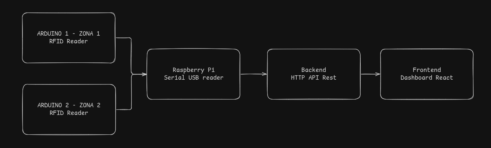
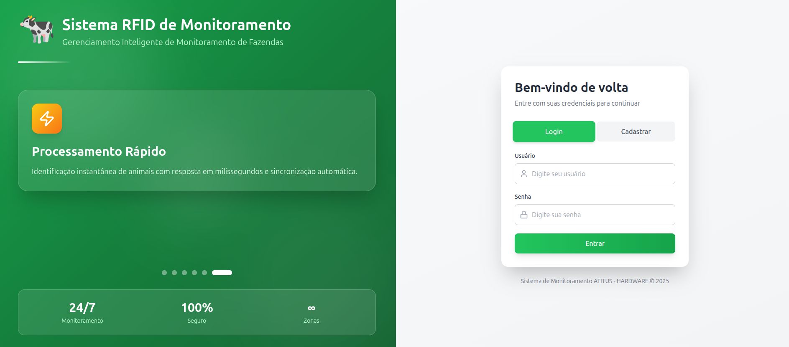
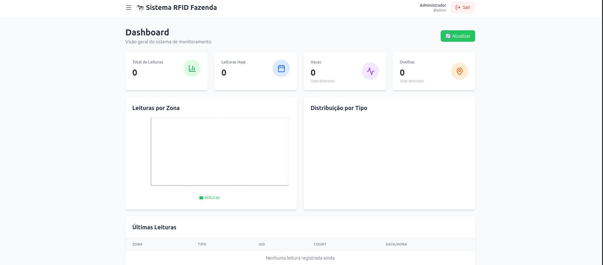

# Sistema de Monitoramento RFID para Fazenda

Sistema completo de IoT para monitoramento e rastreamento de animais em fazendas utilizando tecnologia RFID. O projeto integra hardware (Arduino + RFID), gateway (Raspberry Pi), backend (FastAPI) e frontend (React) para fornecer uma solução end-to-end de rastreamento animal.

## Objetivos

- **Rastreamento Automático**: Identificação automática de animais (vacas e ovelhas) através de tags RFID
- **Monitoramento em Zonas**: Suporte para múltiplas zonas de monitoramento independentes
- **Visualização em Tempo Real**: Dashboard web para visualização de dados e estatísticas
- **Armazenamento de Dados**: Registro histórico de todas as leituras RFID
- **Sistema Resiliente**: Backup local e reconexão automática em caso de falhas

## Arquitetura do Sistema



### Fluxo de Dados

1. **Camada de Hardware (Arduinos)**
   - Arduino Zona 1 e Arduino Zona 2 com módulos RFID MFRC522
   - Detecção automática de tags RFID (vaquinhas e ovelinhas)
   - Feedback visual (LEDs) e sonoro (buzzer)
   - Transmissão via Serial USB (9600 baud)

2. **Camada de Gateway (Raspberry Pi)**
   - Leitura simultânea de múltiplas portas seriais
   - Processamento e formatação de dados
   - Fila de envio com retry automático
   - Backup local em caso de falha de conexão

3. **Camada de Backend (FastAPI)**
   - API REST para recepção de leituras
   - Autenticação JWT
   - Armazenamento em SQLite
   - Endpoints para dashboard e relatórios

4. **Camada de Frontend (React)**
   - Interface web responsiva
   - Dashboard com gráficos em tempo real
   - Visualização de estatísticas por zona
   - Sistema de login e autenticação

## Screenshots do projeto

### Login



### Dashboard



## Tecnologias Utilizadas

### Hardware
- **Arduino**: Microcontrolador para leitura RFID
- **MFRC522**: Módulo leitor RFID RC522
- **Componentes**: LEDs (verde/vermelho), Buzzer
- **Comunicação**: Serial USB (9600 baud)

### Gateway (Raspberry Pi)
- **Python 3.12+**
- **PySerial**: Comunicação serial com Arduinos
- **Requests**: Envio de dados para o backend
- **Threading**: Processamento paralelo de múltiplas zonas

### Backend
- **FastAPI**: Framework web moderno e performático
- **SQLAlchemy**: ORM para gerenciamento de banco de dados
- **SQLite**: Banco de dados relacional
- **JWT**: Autenticação e autorização
- **Uvicorn**: Servidor ASGI
- **Pydantic**: Validação de dados

### Frontend
- **React 19**: Biblioteca para interface de usuário
- **TypeScript**: Tipagem estática
- **Vite**: Build tool e dev server
- **TailwindCSS**: Framework CSS utility-first
- **Recharts**: Gráficos e visualizações
- **Axios**: Cliente HTTP
- **React Router**: Navegação entre páginas
- **Lucide React**: Ícones

## Pré-requisitos

### Hardware
- 1x Raspberry Pi (qualquer modelo com portas USB)
- 2+ Arduinos (Uno, Nano, Mega, etc.)
- 2+ Módulos RFID RC522
- Tags/cartões RFID
- LEDs e buzzers para feedback visual/sonoro
- Cabos USB para conexão Arduino ↔ Raspberry Pi

### Software
- **Raspberry Pi**:
  - Sistema Operacional Linux (Raspberry Pi OS recomendado)
  - Python 3.12 ou superior
  - pip (gerenciador de pacotes Python)

- **Servidor Backend**:
  - Python 3.12 ou superior
  - pip

- **Máquina de Desenvolvimento (Frontend)**:
  - Node.js 18+ e npm

- **Arduino IDE**:
  - Para upload do código nos Arduinos
  - Biblioteca MFRC522 instalada

## Instalação e Configuração

### 1. Arduino (RFID Readers)

#### Instalação da Biblioteca
1. Abra o Arduino IDE
2. Vá em **Sketch → Include Library → Manage Libraries**
3. Procure por "MFRC522" e instale

#### Configuração de Hardware
Conecte o módulo RFID RC522 ao Arduino:

```
MFRC522      Arduino
-----------------------
SDA    ----> Pin 10
SCK    ----> Pin 13
MOSI   ----> Pin 11
MISO   ----> Pin 12
IRQ    ----> (não conectado)
GND    ----> GND
RST    ----> Pin 9
3.3V   ----> 3.3V
```

Componentes adicionais:
- LED Verde → Pin 3
- LED Vermelho → Pin 2
- Buzzer → Pin 4

#### Upload do Código
1. Abra o arquivo `arduino/zona1/sistema_arduino.ino`
2. Modifique `ZONA_ID` se necessário (1, 2, 3...)
3. Atualize os UIDs dos cartões RFID nos arrays `vaquinha1UID`, `vaquinha2UID`, etc.
4. Conecte o Arduino via USB
5. Selecione a porta e placa correta
6. Faça o upload

Repita o processo para cada Arduino/Zona.

### 2. Backend (FastAPI)

#### Instalação
```bash
cd backend

# Criar ambiente virtual
python3 -m venv venv

# Ativar ambiente virtual
source venv/bin/activate  # Linux/Mac
# ou
venv\Scripts\activate  # Windows

# Instalar dependências
pip install -r requirements.txt
```

#### Execução
```bash
# Ativar ambiente virtual
source venv/bin/activate

# Iniciar servidor
python app.py
```

O servidor estará disponível em:
- API: http://localhost:8000
- Documentação Swagger: http://localhost:8000/docs
- Documentação ReDoc: http://localhost:8000/redoc

**Usuário padrão criado automaticamente:**
- Username: `admin`
- Password: `admin123`

### 3. Raspberry Pi (Gateway Serial)

#### Instalação
```bash
cd raspberry

# Instalar dependências
pip install pyserial requests
```

#### Configuração
Edite o arquivo `config.py`:

```python
# Configurar as portas USB dos Arduinos
ARDUINOS = [
    {
        'porta': '/dev/ttyUSB0',  # Verifique com: ls /dev/ttyUSB*
        'zona': 1,
        'baudrate': 9600,
        'timeout': 1,
        'nome': 'Arduino Zona 1'
    },
    {
        'porta': '/dev/ttyUSB1',
        'zona': 2,
        'baudrate': 9600,
        'timeout': 1,
        'nome': 'Arduino Zona 2'
    }
]

# URL do backend
BACKEND_URL = "http://localhost:8000"
```

#### Verificar Portas USB
```bash
# Listar portas USB disponíveis
ls /dev/ttyUSB*
# ou
ls /dev/ttyACM*

# Ver permissões (pode precisar adicionar usuário ao grupo dialout)
sudo usermod -a -G dialout $USER
```

#### Execução
```bash
python serial_reader.py
```

### 4. Frontend (React Dashboard)

#### Instalação
```bash
cd frontend

# Instalar dependências
npm install
```

#### Configuração
Se necessário, ajuste a URL do backend em `src/services/api.ts` ou crie um arquivo `.env`:

```env
VITE_API_URL=http://localhost:8000
```

#### Desenvolvimento
```bash
# Iniciar servidor de desenvolvimento
npm run dev
```

Acesse: http://localhost:5173

#### Build para Produção
```bash
# Criar build otimizado
npm run build

# Preview do build
npm run preview
```

## Como Usar o Sistema

### 1. Iniciar o Sistema Completo

**Ordem recomendada de inicialização:**

1. **Backend** (Terminal 1):
   ```bash
   cd backend
   source venv/bin/activate
   python app.py
   ```

2. **Raspberry Pi Gateway** (Terminal 2):
   ```bash
   cd raspberry
   python serial_reader.py
   ```

3. **Frontend** (Terminal 3):
   ```bash
   cd frontend
   npm run dev
   ```

### 2. Acessar o Dashboard

1. Abra o navegador em http://localhost:5173
2. Faça login com as credenciais:
   - Username: `admin`
   - Password: `admin123`

3. Visualize:
   - **Dashboard**: Estatísticas gerais e gráficos
   - **Leituras**: Histórico de todas as leituras RFID
   - **Zonas**: Informações específicas por zona

### 3. Monitoramento

- Aproxime um cartão RFID do leitor
- O Arduino emitirá um sinal sonoro e visual
- A leitura será enviada automaticamente para o backend
- O dashboard será atualizado em tempo real (recarregue a página)

## Estrutura do Projeto

```
sitema_trabalho_g2/
│
├── arduino/                    # Código dos Arduinos
│   ├── zona1/
│   │   └── sistema_arduino.ino
│   └── zona2/
│       └── sistema_arduino.ino
│
├── raspberry/                  # Gateway Serial (Raspberry Pi)
│   ├── serial_reader.py       # Script principal de leitura
│   └── config.py              # Configurações
│
├── backend/                    # API Backend (FastAPI)
│   ├── app.py                 # Aplicação principal
│   ├── requirements.txt       # Dependências Python
│   ├── fazenda_rfid.db        # Banco de dados SQLite
│   └── venv/                  # Ambiente virtual Python
│
├── frontend/                   # Dashboard Web (React)
│   ├── src/                   # Código-fonte React
│   │   ├── components/        # Componentes reutilizáveis
│   │   ├── pages/            # Páginas da aplicação
│   │   ├── services/         # APIs e serviços
│   │   └── App.tsx           # Componente raiz
│   ├── package.json          # Dependências Node.js
│   └── vite.config.ts        # Configuração Vite
│
└── README.md                  # Este arquivo
```

## API Endpoints

### Autenticação

#### POST `/api/login`
Autenticar usuário e obter token JWT

**Request:**
```json
{
  "username": "admin",
  "password": "admin123"
}
```

**Response:**
```json
{
  "access_token": "eyJ0eXAiOiJKV1QiLCJhbGc...",
  "token_type": "bearer",
  "username": "admin",
  "nome_completo": "Administrador"
}
```

#### POST `/api/usuarios`
Criar novo usuário

**Request:**
```json
{
  "username": "usuario",
  "password": "senha123",
  "nome_completo": "Nome Completo",
  "email": "email@example.com"
}
```

### Leituras RFID

#### POST `/api/leituras`
Criar nova leitura (usado pelo Raspberry Pi)

**Request:**
```json
{
  "zona": 1,
  "tipo_animal": "VAQUINHA",
  "uid": "009F9EBB",
  "count": 5,
  "arduino": "Arduino Zona 1"
}
```

#### GET `/api/leituras`
Listar leituras com filtros

**Query Parameters:**
- `skip`: Offset para paginação (padrão: 0)
- `limit`: Limite de resultados (padrão: 100)
- `zona`: Filtrar por zona específica
- `tipo_animal`: Filtrar por tipo de animal

**Headers:** `Authorization: Bearer {token}`

### Dashboard

#### GET `/api/dashboard`
Obter estatísticas gerais

**Headers:** `Authorization: Bearer {token}`

**Response:**
```json
{
  "total_leituras": 150,
  "leituras_hoje": 25,
  "por_zona": {
    "zona_1": 80,
    "zona_2": 70
  },
  "por_tipo": {
    "vaquinha": 90,
    "ovelinha": 60
  },
  "ultimas_leituras": [...]
}
```

#### GET `/api/estatisticas/zona/{zona_id}`
Estatísticas de uma zona específica

**Headers:** `Authorization: Bearer {token}`

### Status

#### GET `/api/status`
Verificar status do servidor (não requer autenticação)

## Solução de Problemas

### Arduino não detectado
```bash
# Verificar portas USB
ls /dev/ttyUSB* /dev/ttyACM*

# Dar permissão
sudo chmod 666 /dev/ttyUSB0
# ou adicionar usuário ao grupo
sudo usermod -a -G dialout $USER
```

### Erro de conexão com backend
- Verifique se o backend está rodando: http://localhost:8000/api/status
- Verifique a URL em `raspberry/config.py` ou no frontend
- Verifique o firewall

### Frontend não carrega
```bash
# Limpar cache e reinstalar
rm -rf node_modules package-lock.json
npm install
npm run dev
```

### Leituras não aparecem
1. Verifique os logs do Raspberry Pi
2. Teste o backend diretamente via http://localhost:8000/docs
3. Verifique se o Arduino está enviando dados (abra o Serial Monitor)

## Contribuidores

Projeto desenvolvido como trabalho acadêmico - Atitus/Hardware

Bruno da Motta Pasquetti

Gabriel Brocco de Oliveira

Pedro Henrique de Bortolli

Rafael Augusto Klein

